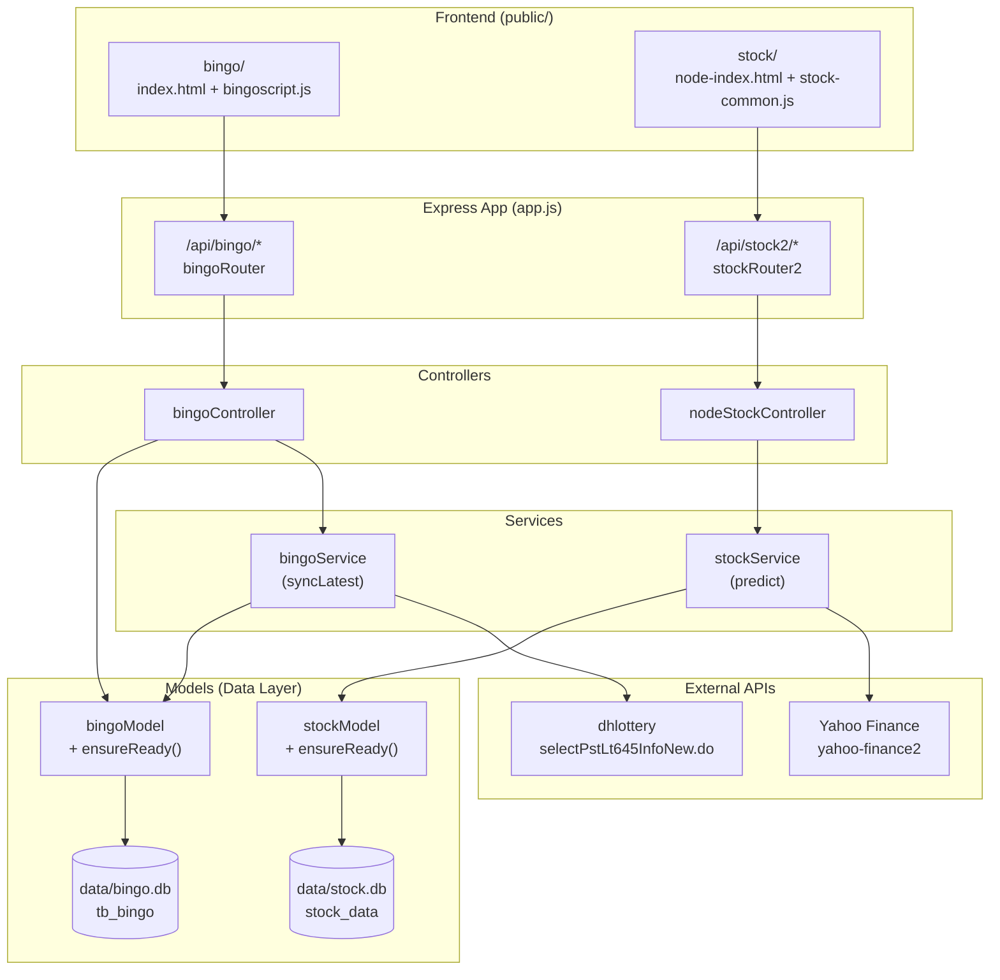
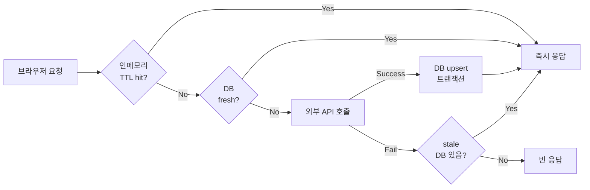
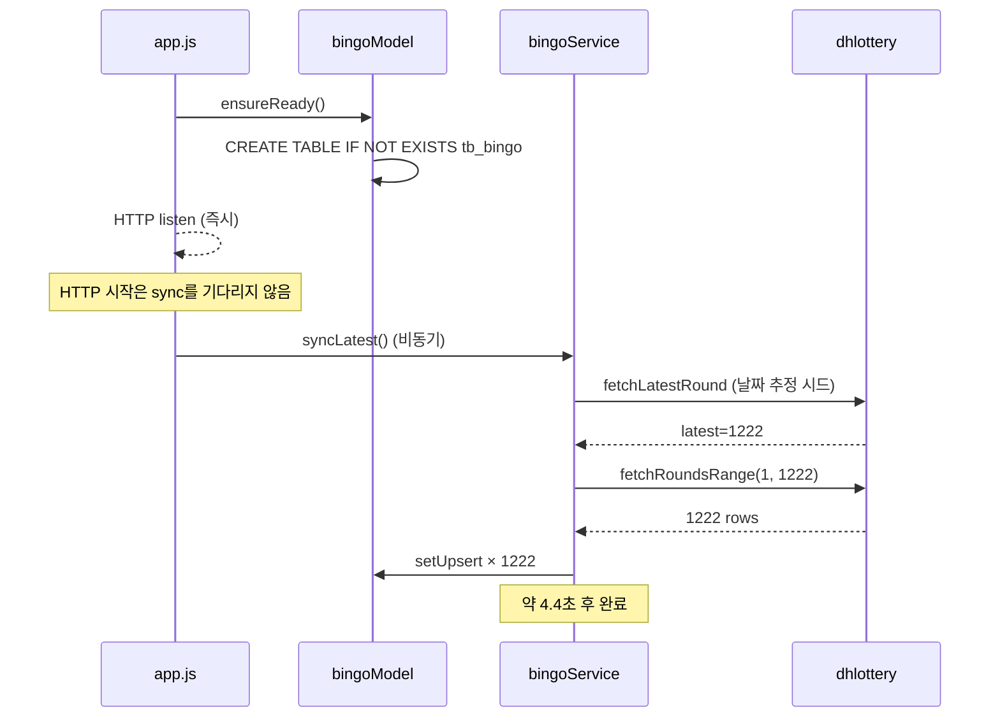
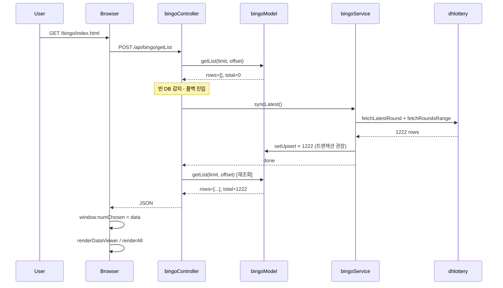

# Architecture Overview

`bingonode`는 두 개의 도메인 모듈(**Bingo 로또 분석기**, **Stock 주가 예측기**)을 단일 Express 서버에 호스팅합니다. 두 모듈은 동일한 백엔드 패턴을 공유합니다 — **3-tier 캐시 (메모리 → SQLite → 외부 API)** 구조에 자동 폴백과 부팅 시 백그라운드 갱신을 갖춘 설계입니다.

## 모듈/계층 구성

## 공통 패턴 — 자동 충전형 캐시 (옵션 C)

두 모듈 모두 다음 흐름을 따릅니다:

| 단계 | Bingo | Stock |
|---|---|---|
| 인메모리 | ❌ (DB가 빠름) | 5분 TTL |
| DB | `tb_bingo` (SQLite) | `stock_data` (SQLite) |
| Fresh 기준 | DB에 데이터 ≥1행 | `max(date)` ≥ 오늘(KST) |
| 외부 API | dhlottery `selectPstLt645InfoNew.do` | Yahoo Finance via `yahoo-finance2` |
| 부팅 sync | `app.js`에서 `syncLatest()` 비동기 트리거 | 첫 요청 시 lazy fetch |
| 폴백 | API 실패 → 빈 응답 (DB 없으면) | API 실패 → stale DB |

## 부팅 시퀀스

## 데이터 흐름 — Bingo 페이지 첫 진입 (DB 비어있을 때)

## 핵심 설계 결정

### 1. 데이터 캐시 전략 = 자동 충전형
- 운영자가 시드/sync를 수동 트리거할 필요 없음
- 부팅 시 백그라운드 sync + 첫 요청 시 폴백 sync — 두 경로 모두 안전
- 한 번 채워지면 외부 API 차단/장애에 면역

### 2. Mandel 인기도 패널티 (Bingo)
- 빈도 분석(Hot/Cold)이 무의미함을 1222회 데이터로 입증
- 비인기 번호 우선 시 1등 동점자 평균 -23.9% (EV 우위)
- `bingoscript.js`의 `scoreNumbers()`에 `HP.gamma` 가중치로 반영
- 검증 결과: [strategy-validation.md](./strategy-validation.md)

### 3. 트랜잭션 일괄 업서트 (Stock)
- 1년치 = 약 250 row × 10 종목 = 2500 row
- 비-트랜잭션 시 약 8~10초 → 트랜잭션 시 ~0.4초 (20배+ 개선)
- `stockModel.upsertMany`에서 `BEGIN/COMMIT` + `ROLLBACK`

### 4. 외부 API 차단/변경 회복력
- dhlottery: 사이트 리뉴얼로 v2(HTML) 파싱 불가 → 날짜 기반 추정 + 후보군 5개 시도로 v1 단독 복구
- yahoo-finance2: 실패 시 stale DB 폴백, 5분 TTL이 throttle

## 정적 파일

| 디렉토리 | 내용 |
|---|---|
| `public/bingo/` | Bingo UI (index.html, bingoscript.js, data.js, styles.css) |
| `public/stock/` | Stock UI (node-index.html, js/stock-common.js, js/stock-chart.js) |
| `public/stylesheets/` | 공용 CSS |
| `views/` | Nunjucks 템플릿 (error.njk 등) |

## 주요 Express 미들웨어 등록 순서 (`app.js`)

1. `morgan('dev')` — HTTP 로깅
2. `express.json()` / `express.urlencoded()` — 본문 파싱
3. `cookieParser()`
4. `express.static('public')` — 정적 파일 서빙
5. 커스텀 `loggingMiddleware` — 메서드/URL/IP/쿼리/본문 로깅
6. 라우터 등록: `/`, `/api/calc/`, `/api/bingo/`, `/api/stock2/`
7. 부팅 시 백그라운드 `bingoModel.ensureReady()` + `bingoService.syncLatest()`
8. 404/에러 핸들러
