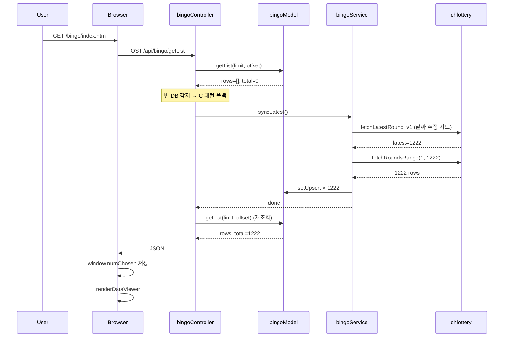
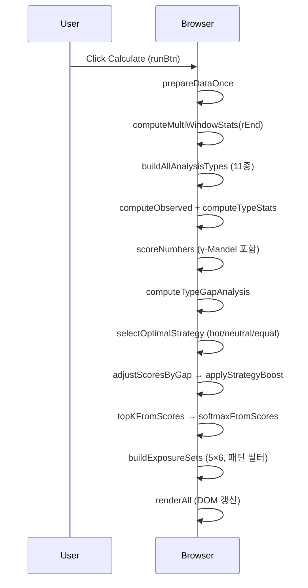
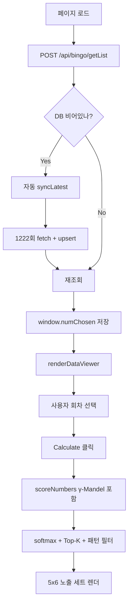

# Bingo Module Specification

## Overview
This document describes the frontend and backend logic for the Bingo (Lotto analyzer) feature accessible via `/bingo/index.html`.

## Frontend Logic (`public/bingo/`)

### Core Files
- `index.html` – Main page layout (header, top split, controls, tables, sets, preview panel).
- `bingoscript.js` – Main application logic:
  - Data fetching from `/api/bingo/getList` (POST) to populate `window.numChosen`.
  - UI rendering functions:
    - `renderDataViewer()` – builds radio‑button table for round selection.
    - `renderAll()` – orchestrates preparation, statistics, scoring, softmax, exposure set generation, and table rendering.
    - Helper utilities: color mapping, gap analysis, strategy selection, scoring, softmax, sampling, pattern filters.
  - Event listeners:
    - Radio button change → updates applied round and triggers `renderAll()`.
    - Cell click → same as radio.
    - Buttons (run, clear log, paste data).
- `data.js` – Bootstraps data: calls `/api/bingo/getList` via `fetchAllBingoAsNumChosen()` and stores result in `window.numChosen`.
- `styles.css` – Styling (DaisyUI/Tailwind base, lotto color chips, highlights, layout).

### Data Flow
1. Page load → `data.js` attempts to fetch history from backend.
2. On success, `window.numChosen` holds array of `[seq, n1..n6, bonus]`.
3. User selects a round via radio (or cell click) → `applyRound` value set.
4. Clicking **Calculate** (`runBtn`) → `renderAll()`:
   - Prepares cleaned data (`prepareDataOnce()`).
   - Computes multi‑window frequency/recency.
   - Builds 11 analysis types (range groups, mod groups, end‑digit, single).
   - Calculates observed counts `O`, expected `E`, standardized residuals `SR`, and weights `α`.
   - Computes base scores `S(n)` from deficit, recency, **and Mandel popularity penalty**.
   - Applies gap‑based adjustments and strategy boost (hot/neutral/equal).
   - Derives top‑k candidates and softmax probabilities `P(n)`.
   - Generates 5×6 exposure sets respecting pattern filters (sum, runs, same‑end, odd, roll, Top‑K constraints).
   - Renders main table (번호, 빈도수, 적용회차 추출, 예상 후보군, 예상 미노출) and exposure sets.

### Key Algorithms
- **Multi‑window statistics**: weighted average of frequencies over windows `[8,15,30,60,90]`.
- **Gap analysis**: variance of standardized residuals per type to adjust scores.
- **Strategy selection**: evaluates hot/neutral/equal strategies on recent window, picks best hit rate.
- **Mandel popularity penalty** (`HP.gamma`, default `0.4`): subtracts a z-normalized "people-pick-this" score from `S(n)`. Empirically validates 1등 동점자 -23.9% in unpopular-pick winning rounds. See [`strategy-validation.md`](./strategy-validation.md).
- **Pattern filters**: ensure generated sets meet sum, consecutive, same‑end, odd/even, roll‑over, and Top‑K constraints.
- **Softmax temperature** (`τ = 1.0`) converts scores to probabilities.

### Scoring Formula

`scoreNumbers(W, rEnd, typeInfo, k, recency)` 마지막 단계:

```
S(n) = Σ(type 가중치 항) + β1·deficitZ(n) + β2·recZ(n) − γ·popZ(n)
```

where:
- `β1=0.6, β2=0.3` — 결손/최신성 가중
- `γ=0.4` — Mandel 인기도 패널티 (HP.gamma)
- `popZ(n) = z-score(popularity(n))` — `popularity()` returns:
  - base `1.0`
  - `× 1.5` if `n ≤ 31` (생일 편향)
  - `× 1.3` if `n ∈ {7, 14, 21, 28, 35, 42}` (7배수)
  - `× 1.15` if `n ∈ {3, 9, 13}` (행운수)

## Backend Logic

### Routes (`routes/bingoRouter.js`)
- `POST /api/bingo/getList` → `bingoController.getList`  *(빈 DB 시 자동 sync 폴백 — C 패턴)*
- `POST /api/bingo/getOne` → `bingoController.getOne`
- `POST /api/bingo/getRecent` → `bingoController.getRecent`
- `POST /api/bingo/sync` → `bingoController.postSync`
- ~~`POST /api/bingo/getPredict`~~ → **라우트 비활성화됨** (2026-05-19) — 예측 서비스 `generatePredictions` 미구현. 엔진 구현 후 `bingoRouter.js`에서 재활성화 예정.

### Controller (`controllers/bingoController.js`)
- Uses **Zod** for request validation (`insertSchema`, `listSchema`, `seqOnlySchema`).
- Delegates to `bingoService` (sync, prediction) and `bingoModel` (DB queries).
- Logging via `@utils/util.js`.
- Endpoints:
  - `getList`: returns `{rows, total, limit, offset}`. **`offset=0` AND `total=0`이면 `bingoService.syncLatest()` 자동 호출 후 재조회**.
  - `getOne`: returns single row by `seq`.
  - `getRecent`: similar to `getList` but orders newest first.
  - `setUpsert`: inserts or updates a round.
  - `postSync`: triggers external sync (returns 202 Accepted).
  - `getPredict`: 라우트 비활성화 상태 (서비스 함수 `generatePredictions` 미구현).

### Service (`services/bingoService.js`)
- **`syncLatest()`** — 외부 API에서 누락 회차를 가져와 `setUpsert`로 저장.
  - 동시성 락 (`syncing` 플래그)으로 중복 호출 방지.
  - 폴백 체인: `fetchLatestRound_v1` → `_v2` → `probeLatestByWalkingFrom`.
- **`fetchLatestRound_v1`** — `selectPstLt645InfoNew.do` JSON 엔드포인트.
  - DB가 비어 있으면 `estimateLatestByDate()`로 시드 회차 추정 (1회 = 2002-12-07 KST 기준 주간 단위).
  - 추정 ±2 회 범위 후보군 5개 시도하여 빈 응답 회피.
- **`fetchRoundsRange(start, end)`** — `selectPstLt645Info.do`로 범위 조회 (1회 호출에 다수 회차).
- **`fetchRoundDetail(drwNo)`** — 단일 회차 (`getLottoNumber` JSON 엔드포인트).

### Model (`models/bingoModel.js`)
- 모듈 로드 시 `ensureReady()`가 `CREATE TABLE IF NOT EXISTS tb_bingo`를 실행.
- 모든 query 함수가 `ensureReady()`를 await하여 첫 호출 race 방지.
- 노출 함수:
  - `ensureReady()`
  - `getList(limit, offset)`
  - `getOne(seq)`
  - `getRecent(rounds)`
  - `getCount(rounds)`
  - `getMaxSeq()` *(syncLatest가 사용)*
  - `setUpsert(seq, row)`
  - `setUpdate(seq, row)`
  - `setDelete(seq)`

#### `tb_bingo` 스키마
```sql
CREATE TABLE IF NOT EXISTS tb_bingo (
  seq        INTEGER PRIMARY KEY,
  no1        INTEGER NOT NULL,
  no2        INTEGER NOT NULL,
  no3        INTEGER NOT NULL,
  no4        INTEGER NOT NULL,
  no5        INTEGER NOT NULL,
  no6        INTEGER NOT NULL,
  no7        INTEGER,
  created_at DATETIME DEFAULT CURRENT_TIMESTAMP
)
```

### Bootstrap (`app.js`)
라우터 등록 후 비-await 백그라운드로:
1. `bingoModel.ensureReady()` — 테이블 보장
2. `bingoService.syncLatest()` — 누락 회차 일괄 갱신

서버 listen은 차단되지 않으며, 첫 사용자가 빈 DB를 만나면 controller의 폴백 경로로도 처리 가능.

## Sequence — 페이지 첫 진입 (DB 비어있는 시점)



## Sequence — Calculate 클릭 후 (DB 채워진 상태)



## Process Flow — 전체 페이지 흐름



## 검증 보고서
- [`strategy-validation.md`](./strategy-validation.md) — Mandel 가설 1222회 데이터 입증 + 3전략 백테스트 비교
- 검증 도구: 자매 프로젝트 [`bingo/compare_strategies.py`](../../bingo/compare_strategies.py)
