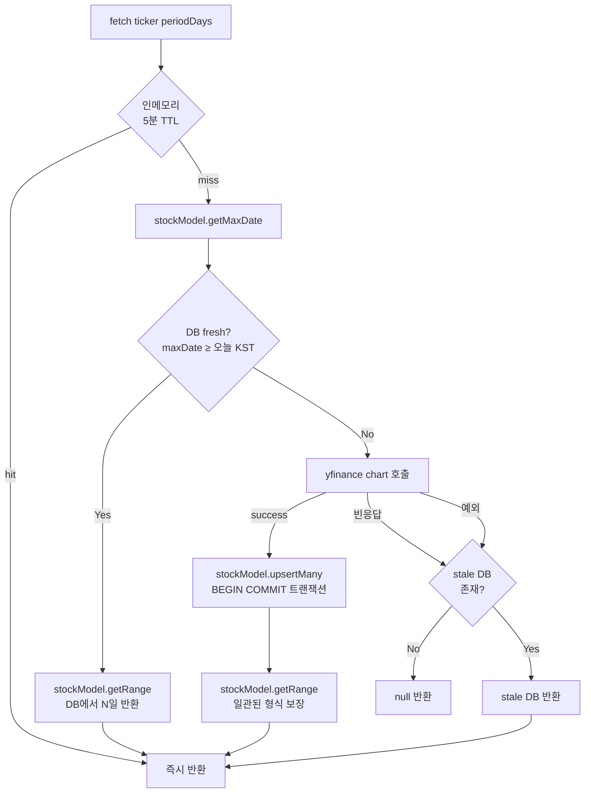
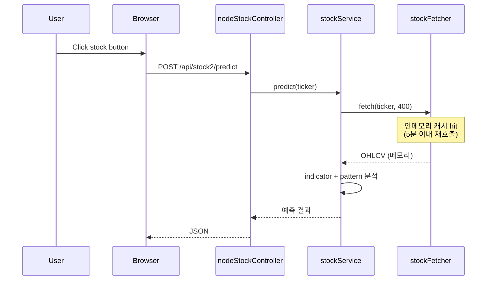
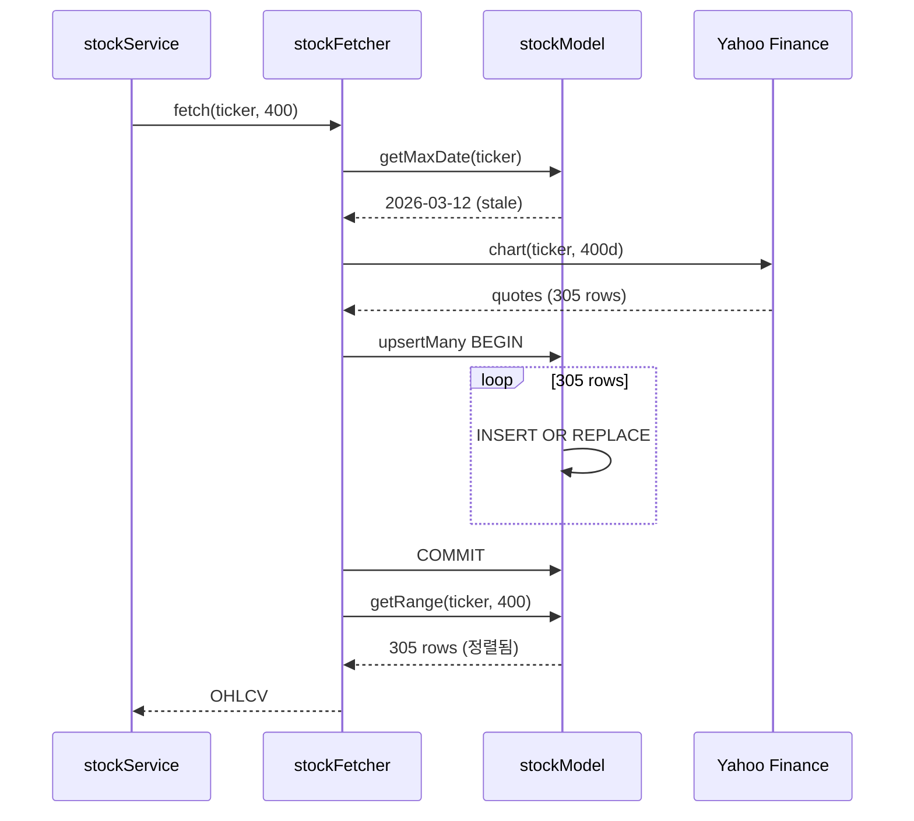
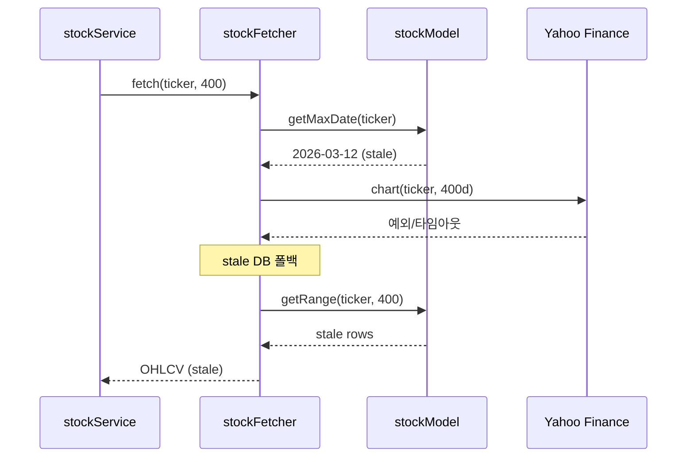
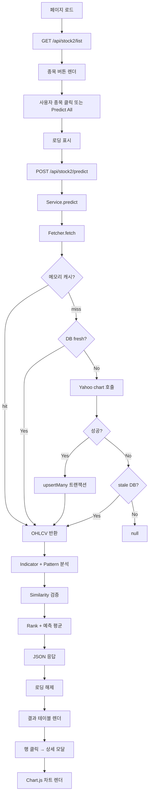

# Hope Stock [Node.js] Module Specification

## Overview
This document describes the frontend and backend logic for the Node.js‑based stock prediction feature accessible via `/stock/node-index.html` (Hope Stock [Node.js]).

> **2026-05 변경 요약** — Python deprecated 컨트롤러의 1년치 SQLite 캐시 설계가 active Node 코드에 복원되었습니다. `stockFetcher.fetch()`가 3-tier 캐시(메모리→SQLite→yfinance)로 동작하며, 외부 API 장애 시 stale DB 폴백을 합니다.

## Frontend Logic (`public/stock/`)

### Core Files
- `node-index.html` – Main page: header, stock selection, results table, detail modal, loading spinner.
- `js/stock-common.js` – Shared utilities:
  - Korean stock list (`stockList`).
  - API base (`API_BASE = window.API_BASE || '/api/stock2'`).
  - Formatters (`formatPercent`, `getDirectionClass`, `getDirectionText`).
  - Low‑level fetch wrapper (`fetchAPI`).
  - Rendering helpers (`renderStockButtons`, `renderResult`, `renderResults`).
  - Loading toggle (`showLoading`, `hideLoading`).
  - Data fetching (`fetchStockData`, `predictStock`, `predictAll`).
  - Modal & detail view (`showDetail`, `closeDetailModal`).
  - Exported as `window.StockCommon`.
- `js/stock-chart.js` – Chart strategy pattern:
  - Abstract `StockChartStrategy`.
  - Concrete `ChartJsStrategy` (uses Chart.js to render price/volume).
  - Factory `createChart(containerId, type, options)`.
  - Exported `window.createChart`.

### Data Flow
1. Page loads → sets `window.API_BASE = '/api/stock2'` (inline script).
2. Loads `js/stock-common.js` and `js/stock-chart.js`.
3. Inline script runs:
   - Calls `renderStockButtons()` → builds buttons for each stock from `window.StockCommon.stockList`.
4. User interaction:
   - Click a stock button → calls `predictStock(ticker)` (delegate to `window.StockCommon.predictStock`).
   - Click "Predict All" → calls `predictAll()` (delegate to `window.StockCommon.predictAll`).
   - Click a result row → calls `showDetail(ticker)` → opens modal, fetches prediction + chart data, renders detail.
5. Internal flow of `predictStock` / `predictAll`:
   - Calls `showLoading()`.
   - Calls `fetchAPI(API_BASE + '/predict', {ticker})` or `/predictAll`.
   - On success: renders result via `renderResult` / `renderResults`; on error: alert.
   - Calls `hideLoading()`.
6. Detail view (`showDetail`):
   - Shows loading.
   - Fetches prediction (`/predict`) and, if needed, OHLCV data (`/data` with days=365).
   - Updates modal title, info/prediction panels, and all‑techniques table.
   - Initializes or updates chart via `window.initChart()` (provided by `stock-chart.js`) and feeds chronological data.
   - On modal close, destroys chart instance.

### Key Points
- No framework (Vue/React); plain DOM manipulation.
- Uses Chart.js for rendering (via strategy pattern).
- All API calls go to `/api/stock2/*` endpoints.
- UI styling via TailwindCSS + DaisyUI (CDN).

## Backend Logic

### Routes (`routes/stockRouter2.js`)
- `POST /api/stock2/list` → `nodeStockController.getStockList`
- `POST /api/stock2/data` → `nodeStockController.getStockData`
- `POST /api/stock2/predict` → `nodeStockController.predict`
- `POST /api/stock2/predictAll` → `nodeStockController.predictAll`

### Controller (`controllers/nodeStockController.js`)
- Thin wrapper: validates required fields, delegates to `StockService`, logs timestamps, returns JSON `{success:true, ...}` or error.
- Endpoints:
  - `getStockList`: returns static Korean stock list.
  - `getStockData`: proxies to `stockService.getStockData(ticker, days)`.
  - `predict`: proxies to `stockService.predict(ticker, trainingDays, threshold)`.
  - `predictAll`: proxies to `stockService.predictAll(trainingDays, threshold)`.

### Service (`services/stockService.js`)
- Coordinates data fetching and technical analysis.
- Dependencies:
  - `StockFetcher` (`@libs/stockFetcher`) – 3-tier 캐시 (메모리→SQLite→yfinance).
  - `IndicatorEngine` (`@libs/indicators`) – computes SMA, EMA, RSI, MACD, Bollinger Bands, ATR, Momentum, Volume.
  - `ChartPatternEngine` (`@libs/chartPatterns`) – detects 39 candlestick patterns.
- Core methods:
  - `getStockList()`: returns hard‑coded KOREAN_STOCKS.
  - `getStockData(ticker, days)`: delegates to `fetcher.fetch(ticker, days)`.
  - `calculateActualChange(data, dayOffset=-1)`: % change between close of day and previous day.
  - `calculateSimilarity(predicted, actual)`: similarity score (0–1) based on direction and magnitude.
  - `validate(predictions, actualChange, threshold)`: returns per‑technique similarity and list of passed techniques.
  - `rankTechniques(similarities)`: sorts techniques by similarity descending.
  - `predict(ticker, trainingDays=240, threshold=0.5)`:
    1. Fetch ~400 days OHLCV via `fetcher.fetch` (캐시 계층 자동 적용).
    2. Split into training (last `trainingDays` days, excluding most recent) and full data (including most recent).
    3. Compute actual change of most recent day.
    4. Run indicator + pattern analysis on training data → predictions map.
    5. Validate against actual change → similarities, passed techniques.
    6. Rank techniques.
    7. Run analysis on full data → next‑day predictions for passed techniques.
    8. Average those predictions weighted by `similarity × hitRate` → `next_day_prediction`.
    9. Assemble result object with ticker, name, last_date, last_close, actual_change, all_predictions, all_similarities, passed_techniques, ranked_techniques, best_technique, best_similarity, next_day_prediction, prediction_direction.
   - `predictAll(trainingDays, threshold)`: loops over `KOREAN_STOCKS`, calls `predict` for each, aggregates results.

### Libraries

#### `libs/stockFetcher.js` — 3-tier 캐시 통합
2026-05 복원: deprecated controller의 SQLite 영속화 패턴을 active 코드로 통합.



- **Layer 1 (메모리)**: 5분 TTL, `cacheKey = ticker_periodDays`
- **Layer 2 (SQLite)**: `stock_data` 테이블, `max(date) ≥ 오늘(KST)`이면 fresh
- **Layer 3 (yfinance)**: `yahoo-finance2`의 `chart()` API 호출
- **폴백**: yfinance 실패 또는 빈 응답 시 stale DB라도 반환 (외부 장애 면역)
- 변환: `{date,open,high,low,close,volume}` 형식 (close=null 행 제외)

#### `models/stockModel.js` — 신규 (2026-05)
- 모듈 로드 시 `ensureReady()`가 `CREATE TABLE IF NOT EXISTS stock_data` 실행.
- `data/stock.db` 별도 SQLite 파일 (bingo와 분리).
- 노출 함수:
  - `ensureReady()`
  - `getRange(ticker, days)` — oldest-first 정렬
  - `getMaxDate(ticker)`
  - `upsertMany(ticker, rows)` — **단일 트랜잭션** (305 row × `INSERT OR REPLACE`)
  - `getCount(ticker)`

##### `stock_data` 스키마
```sql
CREATE TABLE IF NOT EXISTS stock_data (
  id         INTEGER PRIMARY KEY AUTOINCREMENT,
  ticker     TEXT NOT NULL,
  date       TEXT NOT NULL,
  open       REAL,
  high       REAL,
  low        REAL,
  close      REAL,
  volume     INTEGER,
  created_at DATETIME DEFAULT CURRENT_TIMESTAMP,
  UNIQUE(ticker, date)
)
```

##### 트랜잭션 효과 (실측)
| 작업 | 비-트랜잭션 | 트랜잭션 | 개선 |
|---|---|---|---|
| 305 row upsert (단독) | ~800ms | 40ms | 20배+ |
| 전체 fetch (yfinance + DB) | 1227ms | 388ms | 3배 |

#### `libs/indicators.js`
- Implements SMA, EMA, RSI, MACD, Bollinger Bands, ATR via `trading-signals`.
- Prediction functions for each indicator return a predicted % change (e.g., SMA crossover → ±2.0%, deviation → scaled).
- `runAnalysis(data)`: computes all indicators and chart patterns, returns `{predictions}`.

#### `libs/chartPatterns.js`
- Detects 39 patterns (single, two, three candle, reversal, continuation, triangle).
- Each pattern has a strength weight (positive for bullish, negative for bearish).
- `runAnalysis(data)`: scans last few candles for short patterns, runs full‑data scan for multi‑swing patterns, returns `{predictions, detectedPatterns}`.
- `aggregatePrediction(predictions)`: weighted average of pattern strengths.

## Program Sequence Diagram

### 시나리오 1: 캐시 hit (인메모리)



### 시나리오 2: stale DB → yfinance 갱신 → DB 업서트



### 시나리오 3: yfinance 실패 → stale DB 폴백



## Process Flow (Mermaid Flowchart)



## 변경 이력

- **2026-05** — `stockModel.js` 신설, `stockFetcher.fetch`에 3-tier 캐시 적용. 트랜잭션 일괄 업서트로 부팅 시 갱신 시간 8s → 0.4s.
- **이전** — `controllers/stockController.js` (Python+SQLite) deprecated 처리, `nodeStockController.js`로 마이그레이션 (단, 당시 SQLite 영속화는 미복원).

## 참고

- 기술 분석 라이브러리 후보: [`stock-prediction-composite-strategies.md`](./stock-prediction-composite-strategies.md)
- 초기 기획: [`stock_proposal.md`](./stock_proposal.md)
